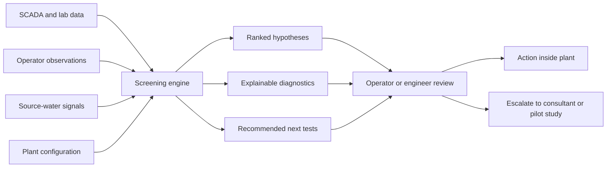
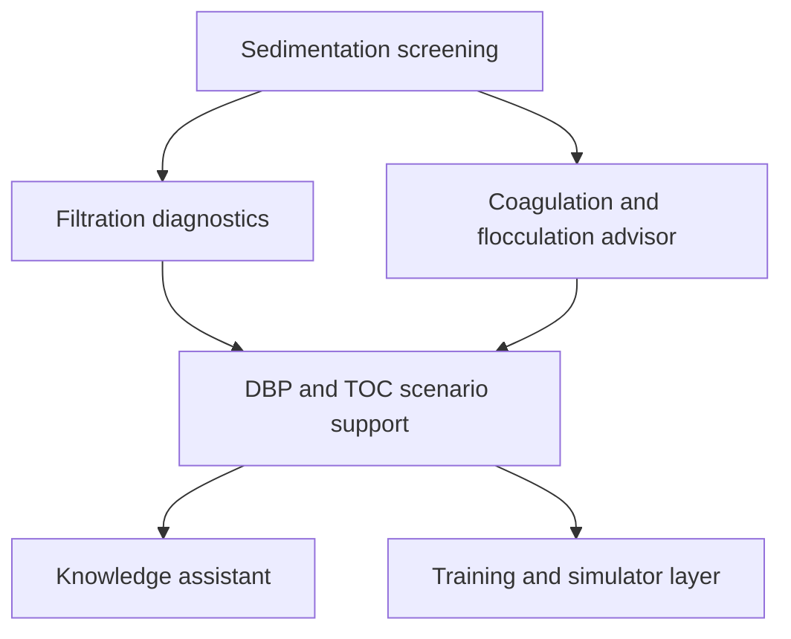

# Deep Research Report on Startup Opportunities in U.S. Potable Water Treatment Software

## Executive Summary

The attached brief is a single research memorandum asking for a skeptical, commercial assessment of startup opportunities in U.S. potable-water treatment software. Its implicit thesis is that there may be overlooked product wedges in treatment-process screening, operator knowledge systems, and simulation/training—and that these should be judged not as academic ideas, but as businesses with real buyers, replacement behavior, and go-to-market constraints. The brief does **not** specify a budget cap, project deadline, target company stage, or a single required methodology; it explicitly says to assume no budget constraint unless the attachment says otherwise, which it does not. fileciteturn1file0

My highest-confidence conclusion is that the strongest initial startup wedge is **not** a broad “water AI platform,” a generic LLM copilot, or a full enterprise digital twin. The best first wedge is a **narrow, explainable, first-pass engineering screening product** for a painful, recurring, specialist-heavy treatment workflow—especially **sedimentation basin diagnosis and optimization**, followed by adjacent modules for filtration and coagulation. That conclusion is driven by four realities: the U.S. drinking-water sector is large but fragmented, most community systems are small, capital funding and workforce pressures remain intense, and many of the most important treatment workflows are still executed through spreadsheets, manuals, consultant studies, jar tests, pilot work, and ad hoc review rather than operational software. citeturn3search2turn3search3turn1search1turn1search5turn1search14turn16search1turn33search14

The reason sedimentation stands out is commercial, not just technical. It is upstream of downstream performance issues, hard to see directly, expensive to diagnose incorrectly, and currently served mainly by engineering judgment, consultant studies, and heavyweight CFD or modeling workflows rather than a simple plant-facing screening product. Generic CFD tools and specialist consultants absolutely exist, but they are not optimized for fast, repeatable, explainable, operator-friendly first-pass screening inside a treatment organization. That leaves room for a product that says, in effect: **“Here is the likely hydraulic/process issue, here is the confidence level, here is what to test next, and here is when to escalate to full engineering review.”** citeturn20search2turn20search3turn20search4turn20search18turn6search9turn15search2

By contrast, generic operator copilots are easier to prototype but much weaker as a standalone business. The water sector itself is still in the early stages of figuring out how to use GenAI safely and productively; sector bodies are researching best practices now, which is a sign of opportunity but also a sign that the category is early, trust-sensitive, and vulnerable to fast commoditization by existing enterprise software, generic copilots, or in-house RAG deployments. Training simulators are real and valuable, but they tend to be more bespoke, slower-moving, and services-heavy. Full digital twins are strategically important, but they are already being pursued by incumbents and usually demand more data integration, change management, and consulting than a startup should want in its first wedge. citeturn18search6turn18search2turn21search4turn10search13turn10search3turn10search1turn32search0turn22search1turn5search1turn24search0

The most important strategic insight is that the moat is unlikely to come from “owning the equations.” The U.S. public sector and industry bodies already provide substantial technical foundations: treatment guidance, optimization frameworks, cost models, treatability databases, and design tools are already available from the EPA and industry programs. A defensible startup moat therefore has to come from **workflow productization**—packaging, data ingestion, explainability, benchmarking, structured human review, evidence traceability, and a service-to-software transition—rather than trying to win by having marginally better raw treatment physics on day one. citeturn30search0turn30search1turn30search13turn19search0turn19search3turn16search0turn16search1

## What the Attachment Requests

The attachment asks for an investor-grade, commercially skeptical research output on under-digitized workflows in U.S. drinking-water treatment. It explicitly requests: a map of important daily/weekly/monthly problem sets; competitive categories and vendors; consultant-heavy patterns that could be simplified into software; a structured evaluation of the “first-pass screening” thesis; a ranking of product candidates; moat analysis; packaging opportunities; a comparison of three strategic directions; a concrete expansion path starting from sedimentation; a thesis attack; and a closing recommendation memo. It is one document, not a packet of multiple files. fileciteturn1file0

The intended audience is not stated verbatim, but the document reads like a brief for a founder, investor, or product strategist evaluating startup formation or wedge selection. The practical stakeholders implied by the brief are utility operators and treatment superintendents, utility managers, consulting engineers, regulators/primacy agencies, and software vendors or OEM-adjacent partners. Constraints and assumptions that are **specified** are: focus on U.S. potable-water treatment, be concrete and skeptical, prioritize commercially actionable judgment, and assume no budget limit unless otherwise stated. Constraints that are **unspecified** include project timeline, target utility size, required revenue model, required pricing band, preferred state or region, regulatory depth expected by deliverable, and whether the recommended business must be software-only or software-plus-services. fileciteturn1file0

### Attachment interpretation matrix

| Requested element from attachment | Present in attachment | How it is handled here | Notes |
|---|---:|---|---|
| Scope and objectives | Yes | This report opens by interpreting the brief and then answers each requested line of inquiry | U.S. potable-water treatment only |
| Required data / metrics / analyses | Yes | Workflow map, competitor categories, ranking logic, go-to-market logic, moat logic, and a decision memo are included | No single required scoring framework was specified |
| Timelines and deliverables | Partly | Deliverables are clear; external deadline is not | Timing for the research itself is unspecified |
| Stakeholders / intended audience | Implied | Founder/investor/product strategy audience inferred; utility and consultant buyers/users mapped explicitly | Not named in the file |
| Constraints and assumptions | Partly | Explicit assumptions are preserved; missing ones are labeled unspecified | Budget explicitly assumed unconstrained |
| Multiple documents handling | No | Single-document synthesis only | No combined multi-doc synthesis needed |

The attachment does **not** ask for a broad “smart water” thesis across distribution, wastewater, or customer-service software. It is much narrower: treatment-process operations, treatment engineering workflows, and adjacent operator/training tools. That narrower framing matters, because it rules out many already-crowded digital-water categories and pushes the analysis toward treatment-specific workflows where software penetration is still uneven. fileciteturn1file0

## Market Map of Under-Digitized Workflows

The most important treatment workflows are not all equally good startup wedges. The sector has formal regulatory and optimization frameworks for turbidity, filtration, DBPs, PFAS, corrosion control, cyanotoxins, compliance reporting, and resilience planning, but many of those workflows still rely on manual interpretation, consultant review, pilot work, and disconnected software or instruments rather than tightly packaged operational products. That is why the opportunity is real, but also why the best opportunities are **bounded**, **explainable**, and **human-in-the-loop** rather than “fully autonomous plant AI.” citeturn7search3turn7search8turn16search0turn16search1turn25search0turn26search0turn27search6turn17search0turn4search6turn29search1

### Workflow map

| Workflow | Likely buyer / daily user | Freq. | Cost if wrong | Current workaround | Why still hard | Existing tool pattern | AI / software fit | Startup attractiveness |
|---|---|---:|---:|---|---|---|---|---|
| Sedimentation basin diagnosis | Treatment manager / operator + engineer | Weekly to episodic | High | Consultant review, plant walkthroughs, CFD, empirical rules | Basin hydraulics are hard to observe directly; symptoms show up downstream | Generic CFD + consultants | High if framed as screening, not final design | **Very high** |
| Filter performance troubleshooting | Plant manager / operator | Daily to weekly | High | Turbidity trend review, IFSA/CPE/AWOP methods, vendor support | Multi-causal; fouling, backwash, media condition, upstream instability interact | Sensors + manual review | High | **Very high** |
| Coagulation dose and pH optimization | Ops manager / operator / lab | Daily | High | Jar tests, streaming current, historical heuristics | Raw water changes rapidly; local chemistry matters | Instruments + spreadsheets + niche software | High | **High** |
| Flocculation quality assessment | Operator / lab / engineer | Daily to weekly | Medium-high | Bench tests, visual observation, jar-testing practice | Visual and operator-skill dependent; poor standardization | Lab tools, niche analytics | Medium-high | **High** |
| DBP precursor control / enhanced coagulation | Compliance manager / operator / engineer | Weekly to seasonal | High | TOC/SUVA review, manual setpoint changes, engineering studies | Risk/risk tradeoff among microbial barriers, chemistry, and cost | Guidance + spreadsheets + consultancy | High | **High** |
| PFAS technology screening | Utility manager / engineer / consultant | Episodic but urgent | Very high | Consultant predesign, pilot planning, EPA tools, vendor studies | High stakes, fast-moving rule context, treatment/cost tradeoffs | EPA models + vendor design tools | Medium-high | **High**, but more consulting-adjacent |
| Corrosion-control scenario support | Utility manager / engineer / compliance lead | Monthly to episodic | Very high | Engineering study, state templates, manual comparison of water quality data | Outcome takes time to validate and can create tradeoffs elsewhere | Guidance + templates | Medium | **Medium** |
| Source-water change impact forecasting | Manager / operator / watershed + treatment staff | Weekly to seasonal | High | Weather awareness, intake monitoring, operator experience | Wildfire, HABs, runoff, and NOM shocks are irregular and local | Monitoring portals + manual planning | High | **High** |
| Cyanotoxin treatment response planning | Operator / manager | Seasonal / event-driven | High | Manual monitoring, treatment checklists, state/EPA plans | Event-driven, data sparse, treatment choices context-specific | Guidance documents, dashboards | Medium-high | **Medium-high** |
| Disinfection CT / residual scenario planning | Operator / compliance lead | Daily to weekly | High | Spreadsheet checks, SCADA review, engineer-approved SOPs | Safety-critical; needs trust and evidence traceability | Existing calculations and SCADA | Medium | **Medium** |
| Backwash / residuals / sludge optimization | Plant manager / operator | Daily to weekly | Medium-high | Rule-of-thumb scheduling, manual trending | Cross-process interactions, disposal costs, limited instrumentation | SCADA + spreadsheets | Medium-high | **Medium-high** |
| Pilot-test planning and pre-pilot screening | Engineer / manager / consultant | Episodic | High | Consultant scoping, pilot vendors, bench work | Hard to know what is worth piloting before paying to pilot | Pilot services + reports | High | **High**, if sold as predesign acceleration |
| Scenario modeling for treatment changes | Engineer / manager | Monthly to episodic | High | Consultant models, plant memory, spreadsheets | Existing products are often too heavy or too generic | Simulation packages | High | **High** |
| Operator knowledge retrieval and troubleshooting | Utility manager / operators | Daily | Medium | SOP binders, tribal knowledge, SharePoint, ad hoc calls | Knowledge is scattered and must be trusted | Generic search / document tools | Medium-high | **Medium** as a first wedge |
| Virtual training / upset-condition simulation | Ops leadership / training lead | Quarterly to ongoing | Medium-high | Classroom training, vendor demos, occasional simulators | Site specificity and control-system integration raise cost | OTS / simulator vendors | Medium | **Medium** as a first wedge |

This map is synthesized from EPA treatment and compliance frameworks for surface-water filtration, AWOP, CPE/CCP, DBP control, PFAS treatment, corrosion control, cyanotoxin response, CCR modernization, CMDP reporting, and AWIA resilience requirements, together with AWWA optimization programs and public vendor/consultant offerings in CFD, pilot testing, and process optimization. citeturn7search3turn7search8turn15search0turn33search14turn25search0turn2search1turn26search0turn27search6turn17search0turn4search6turn29search1turn16search0turn16search1

Two structural market facts make these workflows commercially tricky. First, the sector is enormous in count but not in homogeneous buying power: there are more than 148,000 public water systems in the United States, but more than 92% of community water systems serve 10,000 or fewer people, which means many buyers are small, capacity-constrained, and procurement-conservative. Second, workforce pressure is real: federal and industry sources continue to describe looming retirements, staffing shortages, cybersecurity demands, and capital constraints. That combination makes the market attractive for **time-saving, risk-reducing** software, but hostile to products that require long implementation cycles or expensive customization. citeturn3search1turn3search2turn1search14turn1search5turn29search0turn29search3

## Current Solution Landscape and Competitive Reality

This market is neither empty nor fully digitized. The real competitive picture is a patchwork: free public tools from the EPA; optimization frameworks from industry bodies; niche instrument vendors; compliance/data-management platforms; enterprise “digital water” platforms; training/simulation packages; generic CFD packages; and consultant-led custom studies. The gap is not “no one does anything.” The gap is that many offerings are either too generic, too heavy, too hardware-tied, too compliance-oriented, or too services-led to function as a simple, trusted plant-operations screening product. citeturn30search0turn30search1turn19search0turn16search0turn34search1turn22search1turn5search1turn24search0

### Current categories and representative offerings

| Category | Representative offerings | What exists now | Pricing signal if public | Market state | Implication for a startup |
|---|---|---|---|---|---|
| Public treatment knowledge / engineering references | EPA treatability database, EPA cost models, ETDOT | Strong technical foundations | Public/no-cost | Mature as references, not workflow products | Moat cannot be just “having equations” |
| Sector optimization programs | AWWA Partnership for Safe Water, EPA AWOP, CPE/CCP materials | Strong frameworks and benchmarks | Program/guidance model | Mature as methods | Product opportunity is workflow execution and benchmarking |
| Compliance and reporting software | entity["company","120Water","water compliance software"], entity["company","Klir","water management software"], entity["company","Waterly","utility data software"], entity["company","Locus Technologies","water and ehs software"] | Real market with utility adoption | Mostly quote-based | Crowded enough | Hard place for a new entrant unless treatment-specific |
| Utility data / instrumentation platforms | entity["company","Hach","water analytics company"] Claros, instrument ecosystems | Strong in data, instruments, asset/process support | Mostly quote-based | Established | Best treated as integration/channel, not head-on target |
| Enterprise digital water / digital twin platforms | entity["company","Xylem","water technology company"] Vue powered by entity["company","Idrica","water software company"], entity["company","Veolia","environmental services group"] Hubgrade, entity["company","Hydromantis","water modeling software"] Mantis.AI | Credible enterprise category | Quote-based | Real but not universal | Avoid starting here; use it as later expansion path |
| Generic hydraulic / distribution modeling | entity["company","Bentley Systems","infrastructure software company"] OpenFlows, EPA EPANET | Strong for networks, weaker as plant-ops wedge | OpenFlows Water starts at $1,021 on public store | Established | Not the same as treatment-process screening |
| Treatment design / simulation tools | entity["company","DuPont","water solutions supplier"] WAVE, Hydromantis WatPro | Useful but narrower or heavier usage | WAVE free; others quote-based | Niche but real | Room remains for simpler operational decision tools |
| OTS / simulator tools | entity["company","AVEVA","industrial software company"] OTS, entity["company","Emerson","industrial automation company"] DeltaV OTS / Mimic, Hydromantis SimuWorks | Proven category | Quote-based | Real but bespoke | Good adjacency, weaker first wedge |
| Coagulation / bench-test niche tools | entity["company","Chemtrac","streaming current sensors"], entity["company","Milton Roy","dosing and monitoring company"], entity["company","LowDose Software","coagulant dosing software"], entity["company","RoboJar","jar testing analytics"] | Fragmented niche vendors | Mostly quote-based | Superficially served | Strong signal that pain exists but no dominant SaaS layer |
| CFD and consultant-led diagnosis | entity["company","Ansys","engineering simulation company"] Fluent, entity["company","SimScale","cloud cfd software"], entity["company","Hazen and Sawyer","water engineering consultant"], FLOW-3D HYDRO | Capable but expert-heavy | Software or services pricing; usually quote-based | Active, not operator-friendly | Best proof that “serious tools exist, simple tools don’t” |

The evidence for this landscape is unusually strong because the categories are visible in primary sources: EPA’s Treatability Database and cost models, AWWA’s optimization programs, public pages for compliance platforms, Hach’s Claros suite, Xylem Vue, Veolia Hubgrade, Hydromantis simulation products, DuPont WAVE, AVEVA and Emerson training tools, and public pricing for Bentley’s OpenFlows Water. The main market pattern is therefore not absence; it is **mismatched product form**. citeturn30search0turn30search1turn19search0turn16search0turn13search9turn13search16turn14search0turn14search3turn34search1turn22search1turn22search2turn5search1turn24search0turn23search0turn7search5turn10search13turn10search3turn10search1turn13search3

A crucial strategic nuance is that digital twins are meaningful but not settled. A SWAN utility survey found that about 38% of participating utilities reported having digital twin solutions in place, while 46% did not, which means the category is real but far from universal. That is exactly the profile of a category that is too early, too integration-heavy, and too change-management-intensive to be the ideal first wedge for a startup targeting treatment-operations users. citeturn32search0turn32search18turn22search1turn24search0

## Commercial Judgment on Product Directions

The attachment asks, in effect, whether “simplified screening” can become a product category. The answer is yes—but only if the product is sold as **decision support for bounded workflows**, not as autonomous optimization, and only if it narrows the pattern that currently drives buyers to consultants, prolonged bench testing, or heavyweight engineering tools. That is the commercial sweet spot because consultant-led work is expensive, episodic, and trusted, while pure SaaS is easier to scale but harder to trust; the startup win is the middle ground where software handles the first 60–80% of triage and a human expert or plant engineer still owns the final decision. citeturn33search0turn33search9turn33search13turn15search0turn15search20

The specific “packaging, not science” thesis is also supported by the public tool stack. EPA already offers referenced treatment data, cost models, and ETDOT design tools; industry programs already provide optimization frameworks and assessment methods. So the startup product should not pretend to invent core water-treatment science. It should instead turn fragmented methods into a fast operational workflow: ingest SCADA/lab/context data, detect likely process-limiting factors, rank hypotheses, show the physical rationale, recommend next tests, preserve evidence, and create an exportable handoff for consultants, managers, or regulators. citeturn30search0turn30search1turn19search0turn19search3turn16search0turn7search15

### Comparison of the three strategic directions in the attachment

| Direction | Strengths | Weaknesses | Commercial judgment |
|---|---|---|---|
| Simple workflow / treatment maintenance software | Fastest path to clear ROI; easier procurement; bounded value; explainable | Can look “too small” unless expansion path is credible | **Best first wedge** |
| Vertical AI / operator knowledge system | Easy to demo; clear workforce narrative; broad applicability | Generic models are converging fast; trust and hallucination issues; weak initial moat | **Good feature, weaker company** |
| Pilot / training / virtual plant simulation | Valuable for skill transfer and upset practice; strong long-term defensibility | More bespoke, services-heavy, slower sales, stronger incumbent presence | **Good adjacency, weak first wedge** |

This directional ranking reflects the current state of water-sector AI adoption, the existence of incumbent OTS/simulator vendors, and the fact that the most established software bought by utilities still tends to cluster around compliance, instrumentation, asset/data management, or enterprise digital platforms—not narrow, treatment-specific operational reasoning tools. citeturn18search6turn18search2turn10search13turn10search3turn10search1turn13search9turn14search0turn34search1turn22search1

### Ranked product candidates

| Candidate | Why it wins or loses | Moat potential | Rank |
|---|---|---|---:|
| Sedimentation basin screening and diagnosis | High pain, poor visibility, weak current product form, clear adjacency to filtration/coag | High if benchmark + explainability + consultant handoff are strong | 1 |
| Filter troubleshooting advisor | Frequent pain, clear compliance relevance, good data exhaust | High, but more incumbent overlap with instrumentation vendors | 2 |
| Coagulation / flocculation decision support | Strong recurring value, clear chemistry savings and downstream benefit | Medium-high; niche tools exist but category still fragmented | 3 |
| Source-water change impact forecaster | Strong climate/HAB/wildfire logic, rising urgency | Medium-high; needs external data integration and locality | 4 |
| Pre-pilot treatment screening for PFAS / emerging contaminants | High willingness to pay and strong urgency | Medium; more consultant-/engineering-led and regulation-dependent | 5 |
| Operator copilot grounded in plant knowledge | Broad user appeal | Medium-low as standalone; better as bundled feature | 6 |
| Virtual training / upset simulator for drinking-water plants | Valuable but slower-moving | Medium if tied to proprietary process models | 7 |
| Broad treatment digital twin | Large upside | Low as a first startup wedge because incumbents and integrators are already here | 8 |

### Productization logic

The winning product shape is not “AI runs your plant.” It is closer to: “software screens a problem, shows the likely causes, quantifies confidence, recommends next checks, and creates a defensible review package.” That positioning reduces legal and operational trust barriers, aligns with how utilities already use frameworks like IFSA, CPE, AWOP, and engineering pilot work, and makes the product easier to embed in procurement as a quality/risk/workforce tool rather than a black-box control system. citeturn7search8turn15search0turn16search1turn33search14

This process flow is consistent with how EPA and industry materials frame treatment optimization: performance assessment, identification of limiting factors, corrective action, and escalation when needed. It is also the form least likely to be displaced immediately by generic copilots, because the core value lies in workflow structure, evidence traceability, and domain-specific reasoning rather than a general chat interface. citeturn15search0turn16search0turn18search6

## Sedimentation Wedge Expansion Path

If I were choosing a company from this brief, I would start with **sedimentation basin screening** as the entry wedge and explicitly define the first version as **“first-pass hydraulic and solids-separation diagnosis for conventional surface-water plants.”** The product should not attempt full CFD replacement or final-stamp engineering design. Instead, it should detect likely short-circuiting, density-current issues, uneven flow distribution, poor solids blanket behavior, or basin loading mismatch from available plant data and a lightweight plant-configuration model, then generate recommended checks and explainable reasons. That makes it useful to operators and managers without forcing the startup to claim engineering liability beyond what the product can support. citeturn20search18turn6search9turn20search2turn20search3turn20search4

This wedge also has a strong adjacency map. Sedimentation issues manifest downstream in filter run times, turbidity spikes, backwash frequency, chemical consumption, and DBP precursor persistence. So once the startup has a footprint in sedimentation, it can expand into filtration, coagulation, and source-water change forecasting using the same plant knowledge graph, data connectors, and explanation layer. That is much cleaner than trying to start broadly and then “find a use case later.” citeturn7search8turn16search1turn25search0turn27search6

### A practical expansion sequence

| Phase | Product module | Core buyer | Why it follows naturally |
|---|---|---|---|
| Initial wedge | Sedimentation screening | Treatment manager / superintendent | Clear pain, under-served, consultant-heavy |
| Near-term expansion | Filter troubleshooting | Same buyer | Downstream symptoms often tie back to settled-water quality |
| Near-term expansion | Coagulation and flocculation advisor | Same buyer + lab / operator | Same raw-water context and treatment train |
| Later | DBP / TOC / source-water scenario planning | Compliance + operations | Same chemistry and process data, higher strategic value |
| Later | Operator knowledge layer and guided SOP assistant | Utility-wide | Stronger once workflow engine and trust already exist |
| Later | Training simulator / digital twin lite | Operations leadership | Best built on top of established plant models and customer data |

This roadmap is commercially superior to starting with a generic AI assistant because each step deepens the same operational context, increases switching costs, and improves the startup’s proprietary benchmark set. Over time, the moat becomes not just the model, but the accumulated, structured corpus of plant configurations, symptoms, interventions, outcomes, and “when to escalate” patterns across utilities and consultants. citeturn30search0turn19search0turn32search0turn22search1

## Thesis Attack, Decision Memo, and Recommended Next Steps

The bearish case against this thesis is serious. Many of the best-looking workflows are not daily SaaS events but episodic engineering problems, which compresses budget urgency. Small systems may prefer free guidance, state technical assistance, or outside consultants over new software. Incumbents in instrumentation, digital water, consulting, or compliance could add narrow workflow modules faster than a startup can scale. And if the product is too aggressive in its claims, trust and liability risk will overwhelm adoption—especially in public-health-critical treatment decisions. Those are not edge-case risks; they are central risks. citeturn3search2turn7search18turn16search1turn34search1turn22search1turn5search1

The bullish case is equally real. The sector faces ongoing workforce strain, compliance complexity, and treatment variability; public and industry frameworks already encode much of the domain logic; and the current solution form is mismatched for many treatment users. The best opportunities are where a narrow product can save engineering time, improve consistency, make tacit expertise legible, and produce an audit-friendly work product. In that framing, the startup is not replacing engineers or operators—it is making scarce expertise scale better. citeturn1search14turn1search5turn30search0turn30search1turn16search0turn29search1

### Decision memo

My recommendation is: **build a narrow, explainable treatment-screening company, beginning with sedimentation screening and diagnosis for conventional plants, then expand into filtration and coagulation.** Do **not** start with a generic operator copilot. Do **not** start with a full enterprise digital twin. Do **not** start with a simulator-first training company unless you already have privileged plant-model access or a tight partnership with an incumbent control-system vendor. The first product should look like engineering triage software with a high-trust human review loop, not a black-box AI platform. citeturn20search18turn6search9turn7search8turn16search1turn18search6turn10search13turn22search1

### Recommended next steps

- Interview treatment superintendents, plant managers, and consulting engineers at conventional surface-water plants to validate the top three workflows: sedimentation diagnosis, filter troubleshooting, and coagulation optimization.  
- Collect a small but high-quality dataset from pilot design partners: basin geometry/configuration, SCADA and lab histories, upset events, operator notes, and consultant reports.  
- Design the MVP as a **screening-and-handoff** tool with explicit confidence levels, red-flag thresholds, and exportable engineering-review memos rather than as an auto-control product.  
- Validate whether the first buyer is the utility, the consulting engineer, the contract operator, or an OEM/service network; this is a major open commercial question.  
- Build early defensibility around benchmarking and structured case libraries, not around proprietary claims to generic water-treatment science. citeturn33search0turn33search9turn15search20turn30search0turn19search0

### Follow-up questions

- Which buyer will actually pay first: municipal utility, private utility, consulting engineer, or contract operator?  
- Is the product positioned as an annual subscription, a per-plant license, or a software-plus-expert-review service?  
- Can the initial wedge focus tightly on conventional surface-water plants, or must it handle membranes and groundwater treatment from day one?  
- What level of engineering liability, if any, is the company prepared to accept?  
- What is the minimum dataset required for a useful first-pass sedimentation diagnosis in a typical plant?  
- Is there a channel strategy through instrument vendors, engineering firms, or state technical-assistance programs? citeturn3search2turn34search1turn33search6turn7search18

### Open questions and limitations

Some information the attachment would ideally specify is missing: target customer segment, whether the intended business must be pure SaaS or can include services, preferred pricing envelope, preferred regulatory depth, and whether the focus is exclusively on municipal systems or also includes investor-owned or contract-operated water systems. Pricing visibility for many incumbents is limited because most enterprise vendors in this sector sell by quote, so public pricing evidence is sparse outside a few cases like Bentley OpenFlows and free public tools such as EPA resources or DuPont WAVE. Those unknowns do not change the main recommendation, but they do affect the best go-to-market design. fileciteturn1file0 citeturn13search3turn7search5turn30search0turn30search1